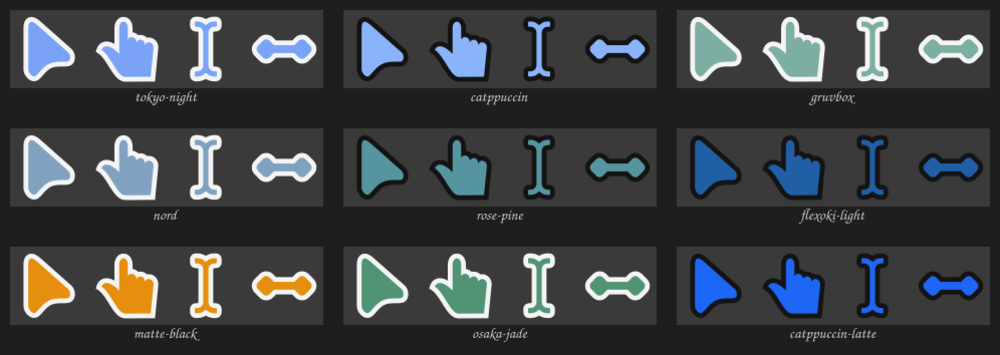
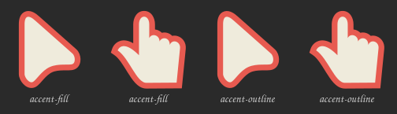

# omarchy-cursor-dye

[](https://github.com/JohnAndante/omarchy-cursor-dye/releases/latest)
[](LICENSE)

Tint your mouse pointer to match the current [Omarchy](https://omarchy.org) theme.

Omarchy retints your terminal, editor, browser, bar and GTK apps on every
`omarchy theme set` — but not the mouse cursor. This fills that gap: it reads the
palette Omarchy already generated, dyes the [Bibata](https://github.com/ful1e5/Bibata_Cursor)
cursor SVGs to match, and compiles one cursor theme (`omarchy-dye`) in **both**
hyprcursor and XCursor formats. Wire it to Omarchy's `theme-set` hook and the
pointer re-dyes itself whenever you switch themes.



- **Vector all the way.** hyprcursor cursors stay SVG — no rasterisation, crisp at
  any size. XCursor bitmaps are rendered for XWayland / Electron / games.
- **Fast.** A colour set builds in well under a second and is cached, so repeat
  themes apply instantly.
- **Light-touch.** Everything lives under `~/.local` / `~/.config`. One managed
  block in your Hyprland config, one file in the Omarchy hook dir. Clean uninstall.
- **No Node, no venv.** Bash + stdlib Python + `hyprcursor-util` + `rsvg-convert`.

## Requirements

Omarchy 4 (Hyprland, Lua config). Packages, all from the official repos:

```bash
sudo pacman -S --needed hyprcursor librsvg xorg-xcursorgen xcur2png python git
```

## Install

```bash
git clone https://github.com/JohnAndante/omarchy-cursor-dye.git ~/Projects/omarchy-cursor-dye
cd ~/Projects/omarchy-cursor-dye
./install.sh
```

The installer fetches the Bibata SVGs (pinned release, ~2 MB, not redistributed
here), links the `omarchy-cursor-dye` command into `~/.local/bin`, drops the
`theme-set` hook, adds a small managed block to `~/.config/hypr/looknfeel.lua`
that pins the `omarchy-dye` pointer, and builds the cursor for your current theme.

Re-run `./install.sh` any time to update; `./install.sh --refresh-svg` also
re-pulls the Bibata artwork.

## Usage

```
omarchy-cursor-dye sync [THEME]     build (if needed) and apply — THEME defaults to the active one
omarchy-cursor-dye build [THEME]    build into the cache only, don't touch the session
omarchy-cursor-dye apply            re-apply the last build (e.g. right after login)
omarchy-cursor-dye status           show resolved colours and cache state
omarchy-cursor-dye clear-cache      drop every cached build
omarchy-cursor-dye config           print config.toml's path and open it in your editor (--path: print only)
omarchy-cursor-dye env              print the Hyprland env snippet (--format lua|conf)

  --force              rebuild even if the colours are unchanged
  --dry-run            print what would happen, change nothing
  --size N             cursor size (default: config / 24)
  --base / --outline / --watch  HEX-or-palette-key   one-off colour override
```

You normally never run it by hand — the hook does. But this is handy:

```bash
omarchy-cursor-dye sync --base '#ff5fd7'     # try a colour without editing config
omarchy-cursor-dye status
```

Already-running apps may keep the old pointer until they restart. Hyprland itself,
and anything launched afterwards, update immediately.

## Configuration

Optional, at `~/.config/omarchy-cursor-dye/config.toml` - `omarchy-cursor-dye config`
opens it in your editor (creating it from the example on first use), or add
`--path` to just print where it lives. See
[`config.example.toml`](config.example.toml) for the annotated version:

```toml
[colors]
base    = "accent"      # palette key, "#hex", or "auto"
outline = "auto"        # auto = dark outline on light themes, light on dark
watch   = "background"

[cursor]
size  = 24
style = "modern"        # modern | original | modern-right | original-right

[xcursor]
sizes      = [24, 32, 48, 64]
anim_sizes = [24, 32]
```

Run `omarchy-cursor-dye sync --force` after any change. After changing **`size`**,
re-run `./install.sh` too — the size is baked into the Hyprland env block so it
sticks across logins.

### Which cursor

`style` picks the Bibata silhouette:

| value | edges | hand |
|---|---|---|
| `modern` *(default)* | rounded | right |
| `original` | sharp | right |
| `modern-right` | rounded | **left** (mirrored) |
| `original-right` | sharp | **left** |

Bibata's named variants (Amber / Ice / Classic) are just colour presets of these
same shapes — irrelevant here, since the colours are what this tool sets.

### How the colours are chosen

Three slots — `base` (fill), `outline` (border), `watch` (spinner disc) — seeded
by a **preset**, then overridable per slot:

| `preset` | base | outline | look |
|---|---|---|---|
| `accent-fill` *(default)* | accent | auto (computed: dark on a light theme, light on dark) | loud - the pointer reads as "the theme's colour" |
| `accent-outline` | foreground | accent | subtler - accent shows as a thin edge |
| `accent-fill-bar` | accent | **bar** (the top bar's real background) | like accent-fill, outline matches your actual bar instead of a computed pole |
| `accent-outline-bar` | **bar** | accent | like accent-outline, fill matches your actual bar instead of the generic foreground |
| `bar-fill` | **bar** | auto (computed) | no accent at all - just the bar's real colour and a computed neutral |
| `bar-outline` | auto (computed) | **bar** | same idea, flipped - the bar's real colour is the outline |

`bar` is not a heuristic — it's `shell.toml`'s `[bar].background` for the active
theme, i.e. whatever colour your top bar is actually rendered in (falls back to
`background`/`foreground` for a theme that doesn't override its own bar).

```toml
[colors]
preset = "accent-fill-bar"
```



Override just one slot without leaving the preset - each value is a **palette
key** from the active theme (`accent`, `foreground`, `background`, `cursor`,
`color0`–`color15`, `red`, `blue`, `selection_background`, `bar`, `bar_text`,
`bar_active`, …), a **hex literal** (`"#ff5fd7"`), or (outline only) `"auto"`:

```toml
[colors]
preset = "accent-fill"
watch = "color2"        # only the spinner disc changes
```

Or try one without editing the file:

```bash
omarchy-cursor-dye sync --base '#ff5fd7' --outline '#101010'
omarchy-cursor-dye sync --base foreground        # palette key works too
```

After any `config.toml` edit, run `omarchy-cursor-dye sync` to pick it up -
nothing watches the file, and the `theme-set` hook only fires on an actual
`omarchy theme set`.

### Size

`[cursor] size` is applied live (`hyprctl setcursor`, `gsettings`) and written
into the Hyprland env block for future logins. `[xcursor] sizes` only controls
which pixel sizes get baked into the XCursor bitmaps — hyprcursor is vector and
always crisp, so this is just for XWayland apps.

## How it works

```
omarchy theme set X
  └─ ~/.config/omarchy/hooks/theme-set.d/50-omarchy-cursor-dye   (X passed as $1)
       └─ omarchy-cursor-dye sync X
            1. read the palette         omarchy-theme-color --file .../colors.toml --all
            2. compute base/outline/watch, hash them
            3. cache hit?  →  install + apply
               cache miss? →  dye every Bibata SVG  (sed 3 placeholder colours)
                              hyprcursor-util --create        → hyprcursors/*.hlc
                              rsvg-convert + xcursorgen        → cursors/* (+ alias symlinks)
                              swap into ~/.local/share/icons/omarchy-dye/
            4. hyprctl setcursor + gsettings + ~/.icons/default/index.theme
```

The theme name (`omarchy-dye`) never changes — only its contents — so the
Hyprland env block is written once and left alone.

`share/cursors.toml` and `share/cursors-right.toml` (the 56 shapes, hotspots and
X11 aliases, per handedness) are distilled from Bibata's own build config by
[`dev/gen-cursors-spec.py`](dev/gen-cursors-spec.py) — rerun
`dev/gen-cursors-spec.py <Bibata_Cursor checkout> share/` if you bump the pinned
Bibata release.

## Uninstall

```bash
cd ~/Projects/omarchy-cursor-dye
./uninstall.sh                 # add --keep-config to keep config.toml
```

Removes the command, hook, built theme, cache and the managed Hyprland block, and
resets the pointer. Log out / back in to clear the cursor env fully.

## Credits

Cursor artwork: [Bibata](https://github.com/ful1e5/Bibata_Cursor) by Abdulkaiz
Khatri (GPL-3.0). Cursor themes this tool produces are derivative works of Bibata
and carry the GPL-3.0; the tool itself is [MIT](LICENSE) - see
[NOTICE.md](NOTICE.md) for the split.
